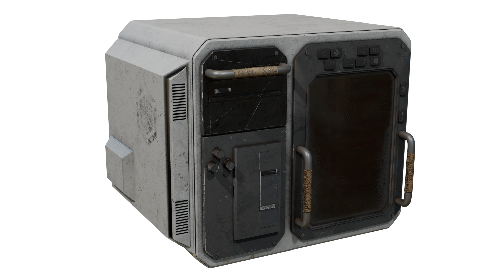
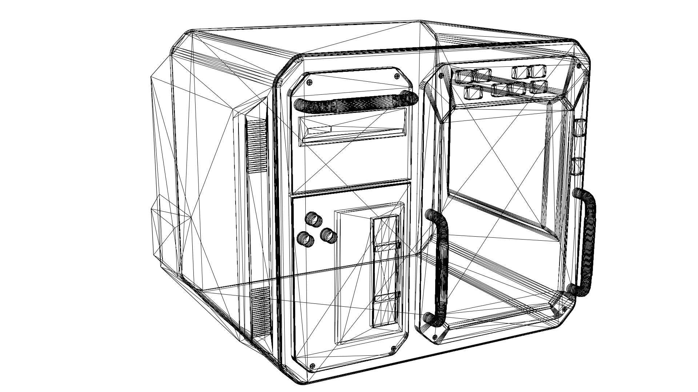
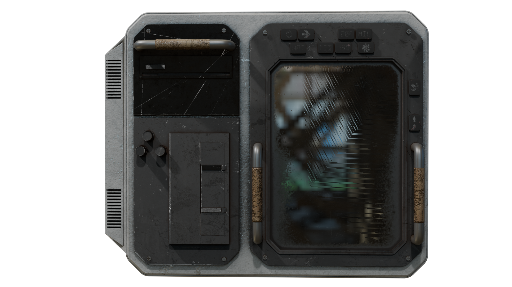
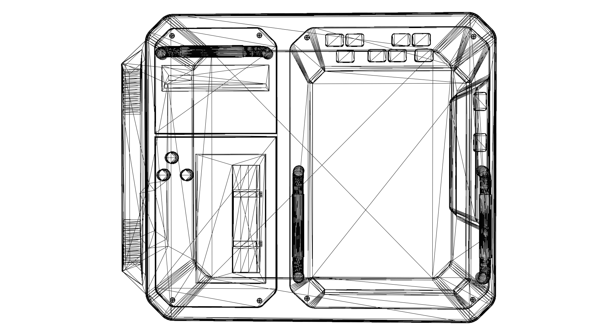
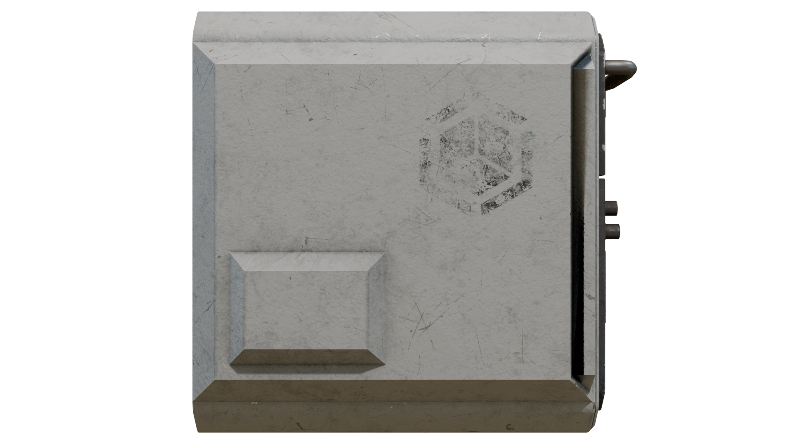

# ThomasDubuc.github.io
Portfolio   
[Link Text](https://www.artstation.com/thomas_dubuc) 

My name is Thomas Dubuc, i've been interested in game deisgn years ago starting with csgo maps and blender modeling and now using full production workflows to model and design proper props. 
 

Texturing 
 
 
Evironmental Constucts 
 
 
Modeling 
 
 
 
 
 
) 

