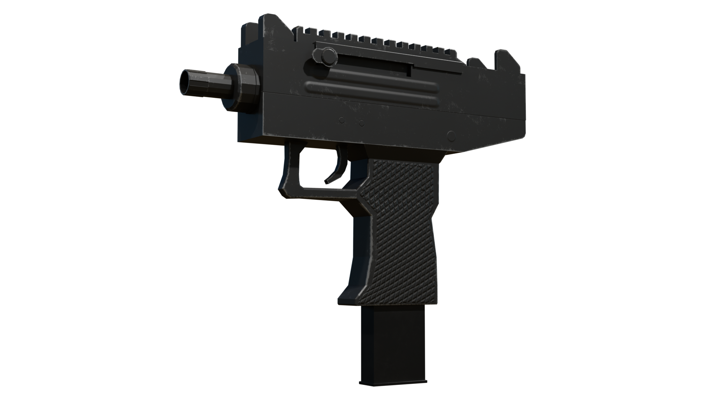
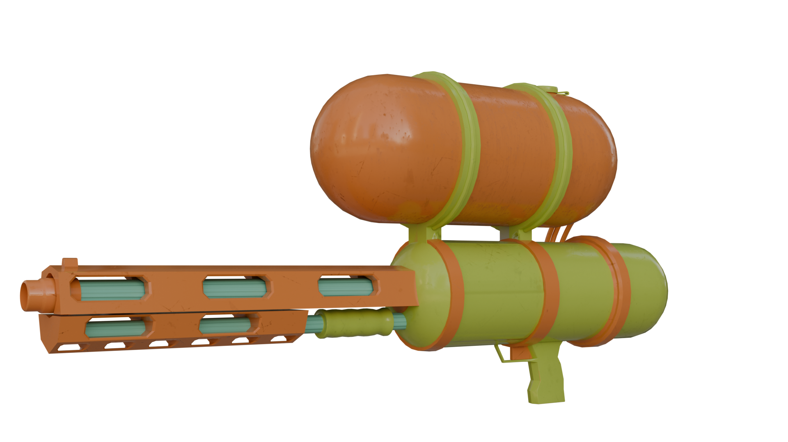

 ThomasDubuc.github.io 
 thomasdubuc.com 
 
Portfolio   

##links! 
 [ArtStation](https://www.artstation.com/thomas_dubuc)
 [Linked In](https://www.linkedin.com/feed/?trk=guest_homepage-basic_google-one-tap-submit)

My name is Thomas Dubuc; I've been interested in game design for years, starting with CSGO maps and Blender modelling and now using complete production workflows to model and design proper assets. I love participating in game jams, especially when modelling in different styles, challenging my creativity by producing a finished product. 

## Contact Me 
thomaswdubuc@gmail.com

(519) 710-9876

##Recent Works

This model was made for the game Malicious Monsters, which is a game I and 6 others are developing. This was a fun model designed off an UZI although I removed certain features to keep with the theme and topology style. It was made in blender and textured in Substance Painter, which I've been developing a better understanding of this workflow, especially when dealing with n-gons.

-1.png)

