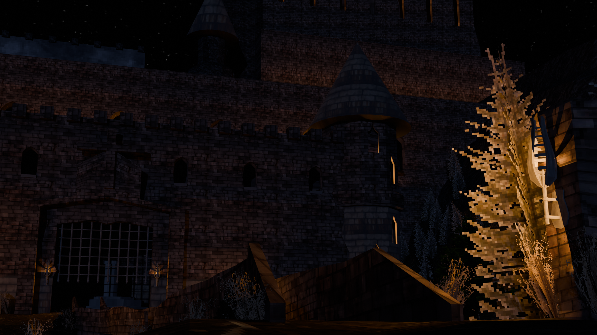

 body {
 background: #CEE864
}ThomasDubuc.github.io 
 thomasdubuc.com 
Portfolio   
links! 
## [ArtStation!](https://www.artstation.com/thomas_dubuc) 
# Thomas Dubuc 

My name is Thomas Dubuc, i've been interested in game deisgn years ago starting with csgo maps and blender modeling and now using full production workflows to model and design proper assets. 
 

Texturing 
 
> [!NOTE]
> Foregrip Model & Textures
 
# foregrip
### Verticle Foregrip, fun making it, learned new texturing strategies with blur and checkerboard patterns!

Evironmental Constucts 
 
> [!NOTE]
> Scope Model & Textures
 
# Scope
### This is a scope I model and textured. This was a new deep dive in adding different layered textures with notches. I found straightening the UVs important to this project, especially for the dials that require notches. Changing the textile densities could be better, especially for the smaller items, which make seeing the back almost impossible. Removing vertices from the pins could also be a good strategy for reducing count without changing larger, more impactful details. The sphericle square located in the middle could also be done with more resolution or a different topology strategy showing better curves when seen up close and to the side. Also, Colors should be better, but I struggle a bit with those due to colour blindness.
But as a second real attempt at realism, I'd say I'm getting better; I think having a bit more direction in topology strategies and colouring/texturing for more real materials. 

Modeling 
 
> [!NOTE]
> Futuristic TV Model & Textures
 
# Futuristic TV  
### This one was fun and took a while in substance, I tried to use the text and icons I previously learned to use effectively. I had two problems with this: the first was in the screen/glass, which has some artifacts(not sure if it is the correct term), and the second is the top left metal panel, which is darker for some reason, not sure why. The handle had too many cuts, along with a few other things, and I think the paint could have looked better. 
 
 
 
 
 
 
 
> [!NOTE]
> Scope Model & Textures
 
 
# Walkie Talkie Model and Textures
### I am proud of this one; Texturing had some new techniques like text and text fading away using a dirt black mask. I think that the wireframe/topologies kinda suck for some of the areas, like lack of loop cuts or too many. 
### But I think the texturing is improving, especially through more layers and focusing on building more in each material. Thining the metal antenna would loot better, especially with the ball on the top. Also, the text might be unrealistic in font and text due to a lack of high-quality images. 
### Overall, getting better and focusing on the modelling part to learn new strategies for good-looking topology needs to be focused.  

# Malicious Monsters
Malicious Monsters is a capstone game developed for school over the school year, we have 8 members who focus on wide veriaty of tasks. I modeld and uv unwrapped the weapons and some props, I found weapons to be challanging and changed the way I viewed topologie and uv editing for different art styles. Malicious Monsters is a low poly game making topology and poly counts to be essential and providing the propper models was difficult, although making and writing down pipelines helped and provided the propper framwork to develope simmilar models.
## Weapons
### AK-47

I chose a foldable stock as a functional and visual choice because it could be used in different states and could be use to add to animations but can be ignore if scope lowers while still keeping fedelity and realism twoards the weapon design. 
 
 
 
 

# Evironmental Design
## Castle Series

This industrial corner is an early attemp I had recreating an area i photographed. It lacks personality and dirt as well as detail and propper lighitng but was still a learning process recreating and replacing the textures and models.

